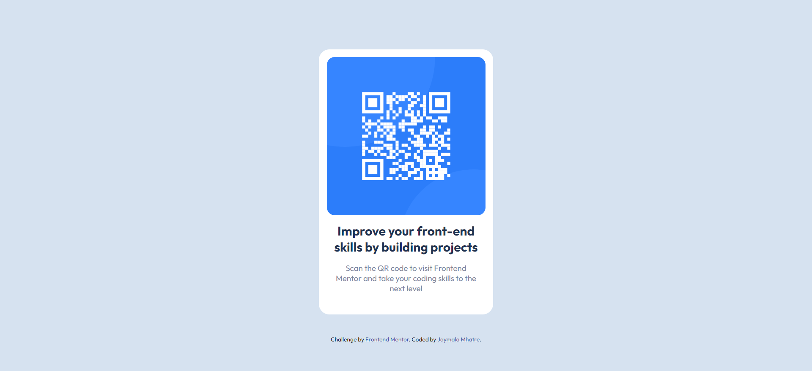

# Frontend Mentor - QR code component solution

This is a solution to the [QR code component challenge on Frontend Mentor](https://www.frontendmentor.io/challenges/qr-code-component-iux_sIO_H). Frontend Mentor challenges help you improve your coding skills by building realistic projects. 

## Table of contents

- [Overview](#overview)
  - [Screenshot](#screenshot)
  - [Links](#links)
- [My process](#my-process)
  - [Built with](#built-with)
  - [What I learned](#what-i-learned)
- [Author](#author)

## Overview
This repository contains my solution for the Frontend Mentor QR Code Component challenge. The challenge involved creating a QR code component using HTML and CSS. As this was my first CSS challenge done independently, I faced some difficulties due to my lack of experience in writing CSS. Despite this challenge, I put forth my best effort to match the output with the expected design.
### Screenshot

### Links

- Solution URL: [Add solution URL here](https://your-solution-url.com)
- Live Site URL: [QR code frontend menotr](https://jaymala-963.github.io/qr-code-frontend-mentor/)

## My process

### Built with

- Flexbox
- Mobile-first workflow

### What I learned

Since this was my first-ever CSS challenge done independently, it took me more time to solve. I had never written any kind of CSS by myself before, so it was a bit challenging for me. However, I persevered and tried my best to match the output with the expected design.

## Author

- Website - [Github](https://github.com/JAYMALA-963)
- Frontend Mentor - [@JAYMALA-963](https://www.frontendmentor.io/profile/JAYMALA-963)

